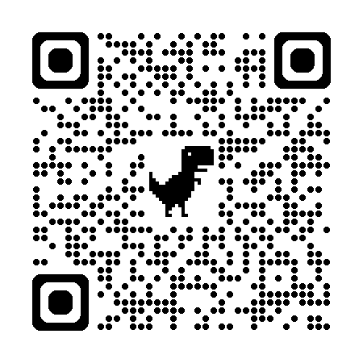

::: nota-secundaria
Roteiro de aula elaborado no RStudio com o auxílio da inteligência artificial ChatGPT e supervisionado pelo professor antes de sua publicação.
:::

## Contextualização

Nesta aula, vamos explorar os modos pelos quais os seres humanos constroem explicações sobre o mundo e vamos buscar compreender o que diferencia o pensamento cotidiano, baseado em experiências não sistematizadas, do pensamento científico.

Ao final deste encontro e com base na leitura indicada, espera-se que você seja capaz de:

- *identificar características do conhecimento do senso comum;*
- *reconhecer a diferença entre senso comum e conhecimento científico;*
- *analisar exemplos de linguagem vaga;*
- *explicar por que a vaguidade dificulta a verificação científica.*

::: leitura
Leitura indicada:

**Conhecimento científico** (p. 23-40), capítulo do livro *Fundamentos de metodologia científica: teoria da ciência e iniciação à pesquisa*, de José Carlos Kochë
:::

## Aprendizagem prática

::: subtitulo-nao-numerado
Enquete
:::

Leia o código QR abaixo e responda à enquete que se segue.

::: subsubtitulo-nao-numerado
Qual é o seu signo?
:::

```{=html}
<figure style="text-align: center;">
  
  <figcaption><strong>Figura 1.</strong> Código QR para a enquete</figcaption>
</figure>
```

<!--
```{=html}
<div style="position: relative; padding-bottom: 56.25%; height: 0; overflow: hidden;">
  <iframe
    src="https://docs.google.com/forms/d/e/1FAIpQLSflOiaMnKWG7To4KXCTAhXZ6mCn5QlGbaPbSrZPP3qjMnT-oQ/viewform?embedded=true"
    frameborder="0"
    marginheight="0"
    marginwidth="0"
    style="position: absolute; top: 0; left: 0; width: 100%; height: 100%;">
    Carregando…
  </iframe>
</div>
```
-->

<br/>

<!--
```{=html}
<div style="text-align:center; margin: 1.2em 0;">
  <a href="https://docs.google.com/forms/d/e/1FAIpQLSflOiaMnKWG7To4KXCTAhXZ6mCn5QlGbaPbSrZPP3qjMnT-oQ/viewform"
     target="_blank"
     style="
       display:inline-block;
       padding:12px 17px;              /* ~20% maior que 10x14 */
       border:2px solid #2b6cb0;       /* mais destaque */
       border-radius:10px;
       text-decoration:none;
       font-weight:700;
       font-size:1.2em;                /* +20% */
       background:#2b6cb0;             /* botão preenchido */
       color:#ffffff;
       box-shadow:0 6px 14px rgba(0,0,0,0.18);
     ">
    Ver respostas
  </a>
</div>
```
-->

::: subtitulo-nao-numerado
Reflexão
:::

Agora que sabemos quais são os signos da turma, vamos refletir juntos:

- Você acredita que as características atribuídas ao seu signo realmente combinam com você?
- Essas características poderiam se aplicar a qualquer pessoa?
- Quem escreve os horóscopos? Quais evidências essas pessoas usam?
- O que faz com que tantas pessoas acreditem em signos, mesmo sem comprovação científica?

## Leitura em foco

::: citacao
O homem é um ser jogado no mundo, condenado a viver a sua existência. \[O homem\] (...) tem que interpretar "a si e ao mundo em que vive, atribuindo-lhes significações. Cria intelectualmente representações significativas da realidade. A essas representações chamamos **conhecimento**. (Kochë, 2016, p. 24 - destaques meus)
:::

::: destaque
Ao interpretar o mundo e a si mesmo, o ser humano não apenas tem conhecimento de sua existência: ele toma **consciência** dessa existência. Conhecer é, antes de tudo, um ato de consciência ativa, que dá sentido à experiência vivida.
:::

::: citacao
O conhecimento, dependendo da forma pela qual se chega a essa representação significativa, pode ser, em linhas gerais, classificado em diversos tipos: **mítico**, **ordinário**, **artístico**, **filosófico**, **religioso** e **científico**. (Kochë, 2016, p. 24 - destaques meus)
:::

::: citacao
As duas formas \[de conhecimento\] que estão mais presentes e que mais interferem nas decisões da vida diária do homem são o conhecimento do **senso comum** e o **científico**. (Kochë, 2016, p. 24 - destaques meus)
:::

::: citacao
A forma mais usual que o homem utiliza para interpretar a si mesmo, o seu mundo e o universo como um todo, produzindo interpretações significativas, isto é, conhecimento, é a do **senso comum**, também chamado de conhecimento ordinário, comum ou empírico. (Kochë, 2016, p. 24 - destaques meus)
:::

## Aprendizagem prática

::: subtitulo-nao-numerado
Enquete
:::

Do mesmo modo, leia o código QR para demonstrar o seu conhecimento sobre o soluço.

::: subsubtitulo-nao-numerado
Qual é o melhor remédio para parar o soluço? Responda com uma ou duas palavras no máximo.
:::

```{=html}
<figure style="text-align: center;">
  
  <figcaption><strong>Figura 2.</strong> Código QR para a enquete</figcaption>
</figure>
```

<!--
```{=html}
<div style="position: relative; padding-bottom: 56.25%; height: 0; overflow: hidden;">
  <iframe
    src="https://docs.google.com/forms/d/e/1FAIpQLSc2xe_KMDhYWBo5diyNmFnXB1h1tvd-wi9ACsefoCy_numXPQ/viewform?embedded=true"
    frameborder="0"
    marginheight="0"
    marginwidth="0"
    style="position: absolute; top: 0; left: 0; width: 100%; height: 100%;">
    Carregando…
  </iframe>
</div>
```

</br>

```{=html}
<div style="text-align:center; margin: 1.2em 0;">
  <a href="https://docs.google.com/forms/d/e/1FAIpQLSc2xe_KMDhYWBo5diyNmFnXB1h1tvd-wi9ACsefoCy_numXPQ/viewform"
     target="_blank"
     style="
       display:inline-block;
       padding:12px 17px;
       border:2px solid #2b6cb0;
       border-radius:10px;
       text-decoration:none;
       font-weight:700;
       font-size:1.2em;
       background:#2b6cb0;
       color:#ffffff;
       box-shadow:0 6px 14px rgba(0,0,0,0.18);
     ">
    Ver respostas
  </a>
</div>
```
-->

::: subtitulo-nao-numerado
Reflexão
:::

Observe a diversidade de respostas sobre o melhor remédio para o soluço. De onde vêm essas ideias? Em que elas se baseiam?

::: destaque
Essa atividade nos ajuda a perceber como o **senso comum constrói soluções práticas** com base na experiência e na repetição, **sem necessariamente ter comprovação científica**. Embora muitas vezes funcionem, essas soluções são transmitidas por tradição, não por validação sistemática. Muitas práticas do senso comum podem funcionar, mas não sabemos por que funcionam nem em que condições funcionam, pois não foram investigadas de forma sistemática. Isso nos convida a refletir: **quando e como devemos confiar no conhecimento do senso comum?**
:::

## Leitura em foco

::: citacao
\[O conhecimento do senso comum\] (...) surge como conseqüência da necessidade de resolver problemas imediatos, que aparecem na vida prática e decorrem do contato direto com os fa­tos e fenômenos que vão acontecendo no dia-a-dia, percebidos principalmente através da percepção sensorial. (Kochë, 2016, p. 25)
:::

São exemplos de conhecimento construído com base no senso comum de uma comunidade:

- uso de cavernas em tempos pré-históricos
- invenção da roda
- uso de lanças e armadilhas
- preparo de remédios caseiros
- confecção de tecidos e vestimentas

::: destaque
**Os quatro pilares do senso comum**

- **Espontaneidade**\
  O senso comum surge de modo natural, não planejado. É construído a partir das experiências imediatas do cotidiano, sem necessidade de investigação formal ou validação externa.

  *Exemplo:* saber que colocar a mão no fogo queima, sem precisar de um experimento controlado.

- **Utilitarismo**\
  Está voltado à solução prática de problemas do dia a dia. Seu valor está no que “funciona”, independentemente do motivo ou fundamento.

  *Exemplo:* tomar chá de boldo para dor de estômago porque "sempre ajudou" — mesmo sem comprovação científica.

- **Subjetividade**\
  O senso comum é interpretado com base na vivência, na cultura e nas crenças pessoais de quem fala. A verdade é relativa à experiência do indivíduo ou grupo.

  *Exemplo:* acreditar que determinadas cores “atraem boas energias” segundo a tradição de fim de ano.

- **Linguagem vaga**\
  Utiliza expressões imprecisas, genéricas ou metafóricas. A falta de precisão dificulta a verificação e o debate crítico.

  *Exemplo:* dizer que algo “faz mal à saúde” sem explicar o quê, por quê, para quem ou em que quantidade.
:::

::: citacao
Esses conhecimentos \[do senso comum\], pelo fato de "darem certo", transformam-se em convicções, em crenças que são repassadas de um indivíduo para o outro e de uma geração para a outra. (Kochë, 2016, p. 26 - aspas minhas).
:::

<br/>

::: subtitulo-nao-numerado
Linguagem vaga (imprecisa)
:::

::: citacao
A linguagem utilizada no conhecimento do senso comum contém termos e conceitos vagos, que não delimitam a classe de coisas, ideias ou eventos designados e não designados por eles, ou o que é incluído ou excluído na sua significação. (Kochë, 2016, p. 27).
:::

<br/>

## Aprendizagem prática

::: subtitulo-nao-numerado
Análise
:::

Assista ao vídeo a seguir e responda oralmente ao que se pede.

::: subsubtitulo-nao-numerado
Por que a linguagem do vídeo abaixo é vaga?
:::

```{=html}
<div style="display: flex; justify-content: center; margin-top: 1rem; margin-bottom: 1rem;">
  <iframe 
    width="384" 
    height="682" 
    src="https://www.youtube.com/embed/5bUinWYq9YY" 
    title="QUEDA DE CABELO NUNCA MAIS 1 INGREDIENTE" 
    frameborder="0" 
    allow="accelerometer; autoplay; clipboard-write; encrypted-media; gyroscope; picture-in-picture; web-share" 
    referrerpolicy="strict-origin-when-cross-origin" 
    allowfullscreen>
  </iframe>
</div>
```

<!-- Aqui começa o campo de respostas-->

<details class="resposta-escondida">

<summary>...</summary>

A linguagem utilizada no vídeo pode ser considerada vaga por diversos motivos:

- Medidas imprecisas: O vídeo instrui o uso de "aproximadamente uns cinco dedinhos de gengibre" e, se for "mais grossinho", "quatro dedos só". As medidas de "dedinhos" e "dedos" são altamente subjetivas e variam de pessoa para pessoa, tornando a quantidade exata do ingrediente ambígua e difícil de replicar consistentemente.

- Termos relativos sobre custo e localização: A descrição de que o ingrediente "se você não tem aí na sua casa tem pertinho de você e custa bem baratinho" usa termos como "pertinho de você" e "bem baratinho". Esses termos são relativos e podem significar coisas diferentes para indivíduos em diferentes contextos geográficos ou financeiros, não oferecendo uma informação concreta.

- Afirmações absolutas e sem qualificação: A promessa de que "seus problemas de queda de cabelo de seborreia e de caspa vão acabar" é uma afirmação muito forte e absoluta. Tal linguagem não permite exceções, variações de resultados ou diferentes graus de eficácia, o que pode ser irrealista e sem base em dados científicos objetivos.

</details>

<!-- Aqui encerra o campo de respostas-->

## Aprendizagem prática

::: subtitulo-nao-numerado
Análise
:::

Ditos populares, também conhecidos como provérbios, são expressões curtas e memoráveis que transmitem conhecimento popular, conselhos práticos e reflexões sobre o comportamento humano e o cotidiano.

Ditos populares são manifestações típicas do senso comum, pois expressam interpretações espontâneas da realidade formuladas a partir da experiência coletiva e da tradição oral.

Essas expressões condensam, em linguagem acessível e metafórica, conhecimentos acumulados ao longo do tempo, sem, contudo, recorrer a métodos sistemáticos de verificação.

::: subsubtitulo-nao-numerado
Analise os ditos populares abaixo e explique oralmente por que eles usam uma linguagem vaga.
:::

::: enfase
Bandido bom é bandido morto!
:::

<!-- Aqui começa o campo de respostas-->

<details class="resposta-escondida">

<summary>...</summary>

A linguagem utilizada no vídeo pode ser considerada vaga por diversos motivos:

- Termo impreciso e genérico: “bandido”\
  A palavra "bandido" não tem, no dito, uma definição clara. Pode se referir a criminosos de diferentes tipos, a pessoas acusadas (mas não julgadas) ou até mesmo a indivíduos rotulados socialmente como marginais, sem respaldo jurídico. Essa vaguidade abre margem para interpretações arbitrárias e discriminatórias.

- Ausência de critérios objetivos\
  Não há definição de quem julga, nem com base em que critérios se define quem é bom ou quem é bandido. A expressão ignora a complexidade das situações, dos contextos sociais e jurídicos envolvidos, e desconsidera princípios fundamentais como o direito à ampla defesa e ao devido processo legal.

- Apelo emocional e moralizante\
  A frase se apoia em um julgamento moral absoluto, típico do senso comum, e não admite exceções ou análises racionais. É uma simplificação extrema de uma questão complexa e serve muito mais para reforçar sentimentos de medo, revolta ou desejo de justiça sumária, do que para promover reflexão crítica.

- Ausência de base empírica ou científica\
  Não há comprovação de que matar alguém considerado bandido contribua para resolver problemas estruturais relacionados à criminalidade. Ao contrário, esse tipo de discurso pode fomentar a violência e a desumanização.

</details>

<!-- Aqui encerra o campo de respostas-->

::: enfase
Em briga de marido e mulher, ninguém mete a colher!
:::

<!-- Aqui começa o campo de respostas-->

<details class="resposta-escondida">

<summary>...</summary>

Podemos dizer que o dito “Em briga de marido e mulher, ninguém mete a colher!” apresenta uma linguagem vaga porque os termos “briga”, “marido e mulher” e “meter a colher” são ambíguos, subjetivos e culturalmente condicionados.

– “Briga” pode significar desde uma simples discussão verbal até situações graves de violência física, mas o dito não especifica essa gradação, tratando todas as situações como equivalentes. – “Marido e mulher” é uma expressão genérica que naturaliza uma configuração familiar tradicional e ignora outros arranjos afetivos. – “Ninguém mete a colher” é uma metáfora que sugere não intervenção, mas sem esclarecer limites ou contextos – o que pode ser interpretado tanto como um conselho de respeito à privacidade quanto como uma justificativa para a omissão diante de casos de violência doméstica.

A falta de delimitação clara dos termos e a possibilidade de interpretações múltiplas, inclusive prejudiciais, são marcas da linguagem vaga típica do senso comum.

</details>

<!-- Aqui encerra o campo de respostas-->

## Aprendizagem prática

::: subtitulo-nao-numerado
Análise
:::

Analise a imagem a seguir para responder oralmente ao que se pede.

::: subsubtitulo-nao-numerado
O enunciado generaliza alguma ideia?
:::


<!-- Aqui começa o campo de respostas-->

<details class="resposta-escondida">

<summary>...</summary>

**1. O enunciado generaliza alguma ideia?**

Sim. A frase generaliza a figura materna, atribuindo a todas as mães um papel idealizado como origem da vida e fonte inesgotável de amor. Desconsidera, portanto, a diversidade de experiências familiares e afetivas, incluindo mães ausentes, negligentes ou relações familiares conflituosas.

**2. O enunciado se baseia em evidências ou em crenças e emoções?**

Baseia-se essencialmente em crenças e emoções. Não há comprovação empírica ou referência a dados que sustentem a ideia de que o amor de mãe seja eterno ou universal. A força da frase reside em seu apelo afetivo, tocando valores subjetivos e culturais enraizados.

**3. O enunciado reforça algum valor ou norma social amplamente aceita?**

Sim. A frase reforça a valorização idealizada da maternidade, um pilar do senso comum em muitas culturas. Sustenta a noção de que mães devem ser incondicionalmente amorosas, cuidadoras e abnegadas, consolidando uma norma social tradicional de gênero.

</details>

<!-- Aqui encerra o campo de respostas-->

<br/>

::: destaque
O **conhecimento científico** se distingue do senso comum porque se baseia em investigação sistemática, linguagem precisa e avaliação crítica de evidências.

O ponto de vista científico se constrói em torno do senso crítico, do pensamento científico e, consequentemente, da linguagem conceitualmente precisa.

**Exemplo de linguagem precisa**

Nesse contexto, este artigo visa responder a seguinte questão de pesquisa: Quais os desafios à implementação de modelos de negócio com foco em sustentabilidade? Para os objetivos da pesquisa, os desafios de implementação são descritos como as dificuldades que as organizações encontram no momento de implementação para que o modelo de negócios obtenha **sucesso**, neste artigo **sucesso** é definido como o alcance dos objetivos propostos na fase de projeto do modelo de negócios.[^aula_2-1]
:::

[^aula_2-1]: Fonte: SOUZA, DANIELA EMILIANO; DE CARVALHO, MARLY MONTEIRO. Modelos de negócios com foco em sustentabilidade: Desafios e barreiras à implementação. São Paulo: Anais do VI SINGEP, 2017. (Adaptado).

## Leitura em foco

::: citacao
A significação dos conceitos, no senso comum, é produto de um uso individual e subjetivo espontâneo que se enriquece e se modifica gradualmente em função da convivência num determinado grupo. As palavras adquirem sentidos diferenciados **de acordo com as pessoas e grupos por quem forem utilizadas**. (Kochë, 2016, p. 27 - destaques meus)
:::

<br/>

::: subtitulo-nao-numerado
Dificuldade de explicação e testagem/controle
:::

::: citacao
Essa vaguidade, essa falta de especificidade da linguagem que dificulta a delimitação da significação dos conceitos, impossibilita a realização de experimentos controlados que permitam estabelecer com clareza quais manifestações dos fatos ou fenômenos se transformam em evidências que contrariam ou que corroboram determinado juízo de uma crença, uma vez que não estão explicitadas quais manifestações empíricas dos fatos ou dos fenômenos lhe são atribuídos. (Kochë, 2016, p. 27)
:::

::: citacao
No senso comum, portanto, a vaguidade da linguagem utilizada conduz a um baixo poder de discriminação entre os confirmadores e os falseadores potenciais de seus enunciados. Torna-se, assim, difícil, quase impossível, o controle e a avaliação experimental. (Kochë, 2016, p. 27)
:::

::: citacao
O conhecimento do senso comum não proporciona uma visão global e unitária da interpretação dos fenômenos. É um conhecimento *fragmentado*, voltado à solução dos interesses pessoais, limitado às *convicções subjetivas*, com um *baixo poder de crítica* e, por isso, com tendências a ser *dogmático*. (Kochë, 2016, p. 28 - destaques meus)
:::

::: citacao
Apesar da grande utilidade que apresenta na *solução dos problemas diários* ligados à sobrevivência humana, ele mantém o homem como *espectador demasiadamente passivo da realidade*, com um baixo poder de interferência e controle dos fenômenos. (Kochë, 2016, p. 28 - destaques meus)
:::

::: destaque
A distinção entre conhecimento do senso comum e conhecimento científico se refere ao modo como o conhecimento é produzido e validado. A tabela abaixo sintetiza algumas dessas diferenças.

| Critério | Conhecimento do senso comum | Conhecimento científico |
|------------------------|------------------------|------------------------|
| Origem | Surge espontaneamente a partir da experiência cotidiana e da tradição cultural. | Surge de investigação sistemática orientada por problemas de pesquisa. |
| Finalidade | Resolver problemas imediatos da vida prática. | Explicar fenômenos e produzir conhecimento confiável e generalizável. |
| Método | Não segue procedimentos sistemáticos de investigação. | Utiliza métodos sistemáticos de observação, formulação de hipóteses e teste empírico. |
| Linguagem | Linguagem vaga, metafórica ou imprecisa. | Linguagem conceitualmente delimitada e tecnicamente precisa. |
| Verificação | Baseado em crenças, tradição ou experiências individuais. | Baseado em evidências empíricas verificáveis e replicáveis. |
| Organização do conhecimento | Fragmentado e voltado a situações específicas. | Busca explicações mais gerais e coerentes entre diferentes fenômenos. |
| Poder crítico | Baixa disposição para questionar crenças estabelecidas. | Envolve análise crítica, revisão e possibilidade de refutação. |
| Controle experimental | Não permite controle rigoroso das variáveis. | Procura controlar variáveis e testar hipóteses de forma sistemática. |

: Comparação entre conhecimento do senso comum e conhecimento científico
:::

::: proxima-aula
[Para a próxima aula:]{.proxima-aula-title}

- **Leia** os textos **Afinal, o que é Ciência?** (p. 7), **Um pouco de História e Filosofia da Ciência** (p. 8-14) e **Racionalidade científica: saindo do piloto automático** (p. 15-16), capítulos do livro *Afinal o que é ciência?... e o que não é*, de André Demambre Bacchi. Disponível na Minha Biblioteca.
:::
