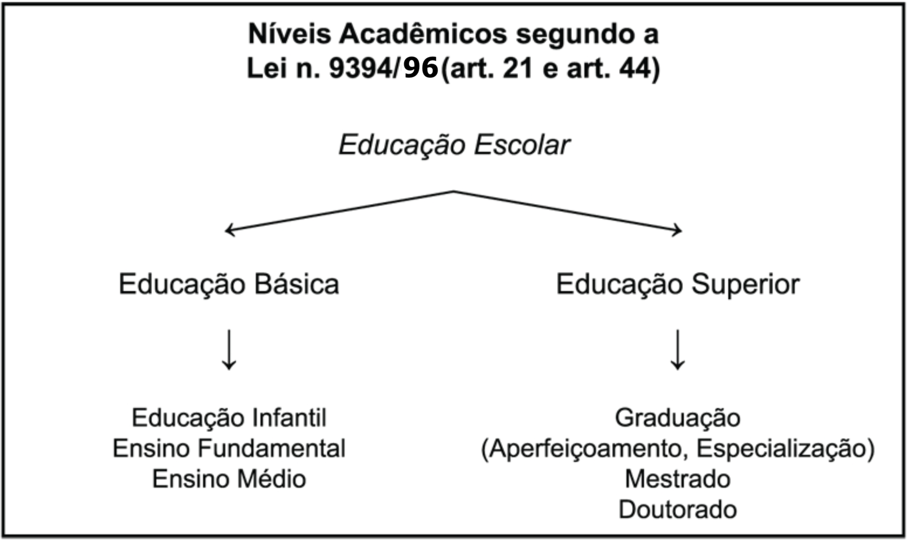

::: nota-secundaria
Capítulo **“Entendendo a organização do sistema acadêmico brasileiro”**, do livro *Guia do trabalho científico: da redação ao projeto final*, de Celso Ferrarezi Junior.
:::

Não é todo estudante que entende bem a organização do sistema educacional brasileiro e seus níveis de ensino. Nem todos sabem, por exemplo, a diferença entre uma **pós-graduação stricto sensu** e uma **pós-graduação lato sensu**. Este capítulo introdutório serve para você se situar no sistema e ter uma clareza maior a respeito das exigências de cada tipo de trabalho de conclusão exigido.

Comecemos pelos níveis educacionais esquematizados no quadro a seguir:

{#fig-niveis-educacionais fig-align="center"}

Agora, vamos conhecer mais detalhadamente cada um desses níveis.

- **Educação Infantil (art. 30)** – Compreende o trabalho efetuado em creches e pré-escolas com crianças antes da idade escolar padrão (seis anos).

- **Ensino Fundamental (art. 32)** – Desenvolvido nas escolas durante nove anos, após a educação infantil e antes do ensino médio.

- **Ensino Médio (art. 35)** – Ocorre após o ensino fundamental e tem duração mínima de três anos. Pode ser profissionalizante ou propedêutico, isto é, com a única finalidade de preparar para concursos vestibulares.

- **Graduação** – Primeira etapa do ensino superior. A duração depende de cada curso escolhido, das normas institucionais e das regras dos conselhos reguladores das profissões (quando há). Confere grau e diploma que pode ser de bacharel (formação técnica), licenciado (formação pedagógica que permite ao graduado exercer o magistério) ou ambos.

- **Aperfeiçoamento** – Curso de pós-graduação (ou seja, depois de concluída a graduação) **lato sensu** com duração mínima de 180 horas, visando ao aperfeiçoamento em determinado aspecto pontual da formação profissional do estudante. Lato sensu significa “geral”, “amplo”. Em outras palavras, trata-se ainda de uma formação de base. Não confere grau, mas fornece um certificado que comprova a conclusão do curso.

  **Requisitos para ingresso** – Graduação (algumas instituições exigem que a graduação tenha sido na mesma área do aperfeiçoamento escolhido).

- **Especialização** – Curso de pós-graduação **lato sensu** com duração mínima de 360 horas, visando ao aprofundamento da formação conferida na graduação, com ênfase na iniciação à pesquisa científica formal e no amadurecimento intelectual. Não confere grau e é comprovado por certificado.

  **Requisitos para ingresso** – Graduação (algumas instituições exigem que a graduação tenha sido na mesma área da especialização).

- **Mestrado** – Primeira etapa da pós-graduação **stricto sensu**, varia em duração de acordo com as exigências institucionais (no geral, de um ano e meio a três anos, podendo chegar a quatro ou cinco anos, conforme as especificidades de cada área). Stricto sensu significa “específico”, “pontual”, “restrito”. Trata-se, portanto, de uma formação mais aprofundada e relacionada a um objeto de estudo bem definido. Assim, o mestrado visa à formação científica do graduado, que deve demonstrar um domínio mais complexo no campo da pesquisa, na área e no tema escolhidos. O mestrando deve ser aprovado em disciplinas formais, apresentar um trabalho por escrito – a **dissertação de mestrado** – e defendê-lo publicamente diante de uma banca examinadora composta por três profissionais qualificados. O resultado final precisa ser relevante e comprovar amadurecimento intelectual e conhecimentos relativos à bibliografia concernente. Confere grau e diploma de mestre.

  **Requisitos para ingresso (em geral):**

  a) Graduação (a maioria das instituições, hoje, exige que a graduação tenha sido na mesma área ou área afim à do mestrado);

  b) Apresentação de projeto de pesquisa ou monografia (a maioria das instituições tem preferido o projeto de pesquisa);

  c) Apresentação de currículo pessoal completo e comprovado;

  d) Aprovação em prova de conhecimento específico da área do mestrado (que ocorre em uma ou duas fases, dependendo da instituição);

  e) Aprovação em prova de língua estrangeira (a maioria das instituições exige o inglês, mas há as que aceitem francês, alemão ou espanhol);

  f) Aceitação de um orientador (consiste em ter a anuência de algum dos professores efetivos do programa para seu projeto de pesquisa).

- **Doutorado** – Segunda etapa da pós-graduação **stricto sensu**; constitui-se no último grau acadêmico que pode ser alcançado no sistema. A duração média de um doutorado atualmente varia entre dois e quatro anos (podendo, entretanto, chegar a oito anos em algumas instituições). Visa à execução de pesquisa científica inédita, original e relevante para o progresso científico, proporcionando um grau elevado de formação científica e relativa independência intelectual do doutorando. Exige grande domínio do conhecimento específico, da bibliografia concernente e dos procedimentos de pesquisa acadêmica, que deve ser demonstrado pela aprovação em disciplinas formais e pela escritura e defesa pública de uma **tese doutoral** avaliada por uma banca examinadora composta por cinco membros altamente qualificados. Confere grau e diploma de doutor.

  **Requisitos para ingresso no doutorado (em geral):**

  a) Graduação ou mestrado, dependendo da instituição (a maioria das instituições, hoje, exige que seja na mesma área ou área afim à do doutorado);

  b) Apresentação de projeto de pesquisa inédito e original;

  c) Apresentação de currículo pessoal completo e comprovado;

  d) Aprovação em prova de conhecimento específico da área do doutorado (que ocorre em uma ou duas fases, dependendo da instituição);

  e) Aprovação em prova de duas línguas estrangeiras (a maioria das instituições exige o inglês associado a francês ou alemão ou espanhol ou italiano);

  f) Aceitação de um orientador (consiste em ter a anuência de algum dos professores efetivos do programa para seu projeto de pesquisa).

Como você pôde perceber, cada nível do ensino superior tem sua especificidade, e quanto mais avançada a formação do aluno, maiores as exigências em relação ao trabalho final que ele deve apresentar.

O sistema brasileiro de ensino superior segue os moldes do sistema europeu e difere em alguns pontos do que é adotado nos Estados Unidos. Para não haver dúvidas, comecemos com um quadro comparativo que mostra a diferença entre a formação pautada pelo sistema norte-americano e a pautada pelo sistema europeu:

**Quadro comparativo entre os sistemas de ensino superior norte-americano e europeu**

| Sistema norte-americano | Sistema europeu (adotado no Brasil) |
|---|---|
| Graduação | Graduação |
| Aperfeiçoamento (Cursos do tipo MBA) | Especialização ou Aperfeiçoamento |
| Mestrado (Master Science – MS) | Mestrado |
| PhD (Philosophus Doctorum) | Doutorado |

Vejamos, agora, respostas objetivas para algumas das perguntas que normalmente são feitas pelos universitários.

## O que é uma área afim e quem define isso?

Áreas afins são áreas de conhecimento consideradas próximas, diretamente relacionadas entre si. Essa relação de proximidade é importante nos estudos acadêmicos, pois define, por exemplo, a possibilidade legal de transferência de um curso de graduação para outro sem a necessidade de novo vestibular, ou a possibilidade de cursar uma pós-graduação stricto sensu. No Brasil, a Capes (Fundação Coordenação de Aperfeiçoamento de Pessoal de Nível Superior), instituição ligada ao Ministério da Educação, publica a Tabela de Áreas de Conhecimento em que podem ser consultadas as grandes áreas e as áreas afins (ela pode ser acessada diretamente no site da Capes: www.capes.gov.br).

## O PhD é um grau mais avançado que o doutorado?

Não. O PhD é o equivalente do doutorado, só que oferecido no sistema norte-americano. Aliás, com o atual relaxamento dos critérios de aprovação de PhDs por algumas instituições dos Estados Unidos, certas universidades europeias têm se recusado a convalidar determinados títulos de PhD como doutorado, optando por fazer a convalidação desses títulos como se fossem de mestrado.

## O que é pós-doutorado?

Pós-doutorado não é um curso, mas um estágio de atualização para doutores que se caracteriza pela execução de um projeto de pesquisa em um período que varia normalmente de três meses a um ano, podendo chegar a dois anos em casos excepcionais. Não há disciplinas, provas ou qualquer outra exigência formal além da aceitação, por uma instituição hospedeira, de um projeto de pesquisa relevante, que é apresentado à instância dessa instituição à qual se deseja ficar vinculado durante o período de pós-doutorado e da qual se pretende utilizar a estrutura instalada e os recursos existentes. Normalmente, os projetos de pós-doutorado são apresentados a departamentos acadêmicos ou coordenações de centros de pesquisa e tramitam dentro da instituição hospedeira de acordo com as normas internas. É necessário que o projeto seja supervisionado por um profissional qualificado da própria instituição, que atue, nesse caso, como anfitrião do pós-doutorando ou seu supervisor. Muitas instituições exigem que o pós-doutorando ajude o departamento ou centro que o recebe com publicações, orientações ou com trabalho de docência. O pós-doutoramento não confere um novo grau ou diploma. O último grau acadêmico que se pode alcançar, como dito anteriormente, é o de doutor.

## O que são livre-docente e professor titular?

São níveis funcionais das carreiras profissionais dos docentes de ensino superior das universidades públicas brasileiras. Nas universidades estaduais de São Paulo, por exemplo, há livre-docência e titularidade. Nas universidades federais, há somente a titularidade. Para alcançar esses níveis de carreira existem concursos públicos de provas e títulos específicos. Nas universidades privadas, a carreira difere bastante, caso a caso.

## O que é defesa direta de tese?

É um dispositivo instituído no Brasil a partir de 2001 (art. 5o da Resolução n. 01/2001/CNE/CES) que permite a um candidato tornar-se doutor diretamente pela defesa de uma tese que ele escreveu sem auxílio da instituição. Faz-se um pedido à instituição com a apresentação da tese já escrita. Se o pedido for aceito, o aluno vai para defesa pública da tese. Se for aprovado, recebe o grau e o diploma de doutor sem ter que cursar os créditos e cumprir os demais requisitos do programa. O dispositivo só vale para as universidades que já o adotaram e regulamentaram.

## Quais são as melhores universidades para cursar mestrado e doutorado no Brasil?

As avaliações da Capes procuram deixar claro aos interessados quais são as melhores universidades para cursar mestrado e doutorado no Brasil. Dependendo do curso desejado, é possível que alguma universidade considerada pequena ou pouco conhecida apresente boa qualidade. Além disso, as avaliações são periódicas, com resultados trienais, e, por isso, os padrões de qualidade de um curso podem mudar de tempos em tempos, melhorando ou piorando. Assim, a melhor forma de conhecer os cursos de pós-graduação é conferir como foram suas últimas avaliações – informação disponível no site da Capes (www.capes.gov.br).

## Como saber se o diploma da universidade que escolhi é válido?

Os cursos de mestrado e doutorado precisam ser autorizados pela Capes. Essa autorização não é permanente e pode ser cancelada, caso o curso seja considerado ruim durante a avaliação dos programas existentes. A única forma segura de saber se o curso está valendo é consultando o site da Capes (www.capes.gov.br).

## O que é dependência em língua estrangeira no mestrado ou no doutorado?

É a condição em que fica um aluno que foi aceito no programa de mestrado ou doutorado quando não consegue uma boa nota na prova de língua estrangeira. O programa dá um novo prazo (geralmente, seis meses) para que o aluno tente novamente e comprove suficiência na língua exigida. Caso seja reprovado, não poderá concluir o curso, mas seus créditos cursados com êxito não são invalidados.

## Quanto custa cursar especialização, mestrado e doutorado no Brasil?

Em uma universidade pública, não custa nada, embora algumas cobrem taxas mínimas de matrícula e expedição de diploma. Algumas delas oferecem cursos de pós-graduação por meio de suas fundações de apoio. Nesse caso, há custos semelhantes aos cursos de instituições privadas. Nas faculdades e universidades privadas, as mensalidades variam dependendo do curso e da instituição e não costumam ser baixas. É bom informar-se também a respeito dos custos e das disponibilidades de uso de materiais da instituição escolhida e de seus locais de pesquisa. Investigue com antecedência como é o acesso a livros, instrumentos, computadores, laboratórios, arquivos etc.

## Os mestrados e doutorados do exterior, por exemplo, dos Estados Unidos ou da Europa, são melhores que os do Brasil?

Não necessariamente. Muitas vezes, é o contrário e encontram-se muitos alunos estrangeiros, inclusive de países desenvolvidos, cursando mestrado e doutorado em nossas universidades. O que fundamenta ideia errônea sobre a qualidade inferior de nossos cursos em comparação aos de fora é que, em um país de tradição colonial como o Brasil, o que é “estrangeiro” é comumente mais valorizado, embora nem sempre seja melhor. Há casos, porém, em que uma universidade de outro país detém tecnologias exclusivas, arquivos específicos ou professores altamente especializados em determinado assunto que interessa ao aluno ou pesquisador – aí, sim, tal universidade será a mais apropriada para a realização do mestrado ou doutorado. Não podemos esquecer, ainda, a possibilidade de intercâmbios acadêmicos de acordo com as disponibilidades e interesses dos candidatos e das instituições envolvidas. Em muitos casos, vale a pena pesquisar esse assunto.

Espero que, com este capítulo introdutório, você tenha se localizado no sistema brasileiro de ensino superior, sabendo exatamente onde está, conhecendo as exigências para seu nível de estudo e, portanto, as preocupações que deve ter em relação a seu trabalho final. Passemos, então, a tratar de seu projeto de pesquisa científica, aquele que deverá nortear a execução do trabalho e a elaboração do documento final.
